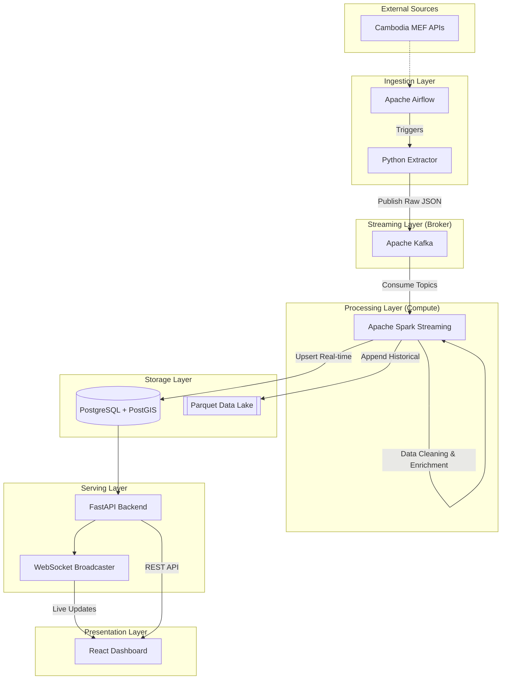

# Presentation Guide: CamAir - Cambodia Environmental Monitoring Platform

This document serves as a comprehensive guide for your final project presentation to your Data Engineering lecturer. It covers the architecture, data flow, technical stack, and engineering decisions.

---

## 1. Project Title & Vision
**Title**: CamAir: Real-Time Environmental Intelligence for Cambodia  
**Vision**: A modern, scalable data platform that provides citizens and policymakers with live Air Quality (AQI), Weather, and UV index insights across all 25 provinces of Cambodia.

---

## 2. System Architecture
The system follows a **lambda-style architecture** principles, combining real-time streaming with long-term analytical storage.

### 2.1 High-Level Architecture Diagram

---

## 3. The Data Pipeline (ETL/ELT)
As a Data Engineer, the focus is on the robustness and reliability of the data flow.

### Phase 1: Ingestion (The Extractor)
- **Tool**: Apache Airflow.
- **Logic**: Periodically (every 15-60 mins) polls three REST endpoints (AQI, Weather, UV).
- **Decoupling**: Instead of writing directly to the database, the extractor pushes raw JSON to **Kafka**. This ensures that if the database is down, data isn't lost.

### Phase 2: Streaming Broker (Kafka)
- **Topics**: `raw_air_quality`, `raw_weather`, `raw_uv`.
- **Role**: Provides high-throughput, fault-tolerant message queuing. It allows the processing layer to scale independently of the ingestion layer.

### Phase 3: Processing (Spark Structured Streaming)
- **Logic**: 
    - Consumes raw Kafka messages.
    - Parses JSON schemas into typed DataFrames.
    - **Data Enrichment**: Calculates timestamps, cleans null values, and maps condition codes to icons.
    - **Sinks**: 
        - **PostgreSQL**: Stores the *current state* for the live dashboard.
        - **Parquet**: Stores the *event history* on disk for future Big Data analysis (Trend prediction/Machine Learning).

---

## 4. Data Modeling & Storage

### 4.1 Relational Database (PostgreSQL)
We use a relational model to serve the API efficiently.
- **Key Tables**: `processed_air_quality`, `processed_weather`, `processed_uv_index`.
- **Optimization**: Uses `DISTINCT ON (name)` logic in queries to always fetch the latest record per province.

### 4.2 Geospatial Power (PostGIS)
- **Spatial Data**: Cambodia province boundaries are stored as `GEOMETRY` objects.
- **Capabilities**: Enables spatial queries like "Find air quality within 50km of Phnom Penh" or "Calculate distance between centroids."
- **Index**: GIST spatial indexing for sub-millisecond query performance.

---

## 5. Technical Highlights (For the Lecturer)

When presenting, emphasize these "Data Engineering" specific points:

1.  **Fault Tolerance**: Using Kafka as a buffer prevents data loss during API spikes or database maintenance.
2.  **Scalability**: Apache Spark allows us to process data for 25 provinces or 25,000 sensors with the same code logic.
3.  **Real-Time Synchronization**: The integration of **WebSockets** with the FastAPI backend means the frontend dashboard updates instantly without the user needing to refresh.
4.  **Data Lake Readiness**: By sinking data to Parquet format, the system is ready for integration with modern Data Lakehouses (like Databricks or Snowflake) for historical trend analysis.
5.  **Schema Enforcement**: Spark ensures that only valid, cleaned data enters the production database, preventing "Garbage In, Garbage Out."

---

## 6. Tech Stack Summary

| Layer | Technology |
| :--- | :--- |
| **Orchestration** | Apache Airflow |
| **Streaming** | Apache Kafka |
| **Compute** | Apache Spark (PySpark) |
| **Database** | PostgreSQL + PostGIS |
| **API** | FastAPI (Python) |
| **Frontend** | React + TypeScript + Leaflet |
| **Infrastructure** | Docker & Docker Compose |

---

## 7. Future Roadmap
- **Predictive Analytics**: Use the Parquet historical data to build an LSTM model for AQI forecasting.
- **Alerting System**: Trigger Telegram/Email alerts when AQI reaches "Unhealthy" levels.
- **Mobile App**: Expand the React frontend into a Progressive Web App (PWA).

---

*This guide was prepared by Gemini CLI to assist in the presentation of the CamAir Data Engineering project.*
